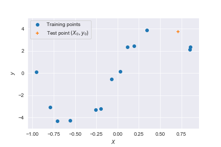

[back](./)

# Generalization and Deep Neural Networks

### Basics of statistical learning

We'll start out with the basic setup of statistical learning in the supervised setting.
Here, we usually assume that we have some training dataset $$\mathcal{D} = \{(X_1,y_1), (X_2, y_2),...,(X_n,y_n)\}$$
of $$n$$ observations, drawn independently from some distribution $$\mathbb{P}_{X,y}$$. Our goal is
to use the training set $$\mathcal{D}$$ to find a function $$\hat{f}_{\mathcal{D}}$$ which can accurately predict $$y$$ from $$X$$. For example, if $$y$$ is a continuous variable (for example, taking values in $$\mathbb{R}^k$$) we might take

$$
\hat{f}_{\mathcal{D}} = \arg\min_{f\in \mathcal{F}} \frac{1}{n}\sum_{i=1}^n \|f(X_i) - y_i\|^2 \hspace{20mm} (1)
$$

Here we use the notation $$\hat{f}_{\mathcal{D}}$$ to emphasize the fact that we are using the training set
$$\mathcal{D}$$ to choose the function $$\hat{f}_{\mathcal{D}}$$. The set $$\mathcal{F}$$ is some pre-determined class of functions that
we're willing to let $$\hat{f}_{\mathcal{D}}$$ come from. This set will be important later on, but for now we can just think of it as being
any set of functions that we think might contain a good candidate for fitting our data.  

Importantly, we don't just want the function $$\hat{f}_{\mathcal{D}}$$
to perform well on the training points $$\mathcal{D}$$, but rather to perform well on _new_ points $$(X_0, y_0) \sim \mathbb{P}_{X,y}$$
that we haven't seen during training. This is where the "learning" part of statistical learning comes in: we hope that the training set
$$\mathcal{D}$$ contains enough information to _learn_ something about the whole population $$\mathbb{P}_{X,y}$$. Unfortunately,
we can, and frequently do, run into the problem of _overfitting_, as illustrated by the following example.

***
**Example 1.** (Overfitting.)

Suppose that we have we have the following training set of $$n=8$$ points $$(X_1,y_1),...,(X_8,y_8)$$, together with a testing point $$(X_0,y_0)$$ drawn from the same distribution.

We're interested in fitting a model to this data, using the squared error (1). To do so, we need to choose the model class $$\mathcal{F}$$ that we want
our candidate functions to come from. A reasonable choice might be to take

$$
\mathcal{F}_p = \{f(x) = b_0 + b_1 x + b_2 x^2 + \cdots + b_p x^p : b_k \in \mathbb{R}\}
$$

of degree $$p$$ polynomials. Notice that we can always set some coefficients to be zero, so that the classes $$\mathcal{F}_p$$ are only getting larger
as $$p$$ gets larger. Let's see what happens when we choose $$p=1$$:

This does okay, but it doesn't really capture the full trend in the data. Let's try some higher degree polynomials and see what we get:

We notice that for $$p=2$$, we still don't quite capture the full trend. We start to get something interesting for $$p=4,6$$, and for $$p=12$$ we are easily able to fit all $$8$$ training points. However, when we look at performance on the testing point $$(X_0,y_0)$$, we see a different story: the degree 12 polynomial does horribly, and the simpler models (even the degree 1 and 2 polynomials) do much better. The problem is that the class $$\mathcal{F}_{12}$$ was somehow "too big", and as a consequence the model we obtained was _overfit_ to the dataset $$\mathcal{D}$$.

***

As the above example demonstrates, if we want to avoid overfitting, we need to be careful when choosing the class $$\mathcal{F}$$. We saw that the issue
arose when we made the class $$\mathcal{F}$$ "too big". We often use the term _capacity_ to describe how big a set of functions $$\mathcal{F}$$ is.

There are many ways to measure the capacity of a set $$\mathcal{F}$$ -- this will be a central topic when we get into more realistic example. For now we'll use the notation $$\mathscr{C}(\mathcal{F})$$ to denote some measure of capacity of a set $$\mathcal{F}$$. For example, we could use $$\mathscr{C}(\mathcal{F}_p) = p$$ for $$\mathcal{F}_p$$ defined in Example 1.

Many of the core results in statistical learning theory involve bounding the testing error by various capacity measures. A typical result is something like the following: suppose $$f$$ was fit to a dataset $$\mathcal{D}$$ using the class $$\mathcal{F}$$. Then (with high probability), we have

$$
\mathbb{E}_{(X,y)\sim \mathbb{P}_{X,y}}[\|f(X) - y\|^2 ]\leq \frac{1}{n}\sum_{i=1}^n \|f(X_i) - y_i\|^2 + \sqrt{\frac{\mathscr{C}(\mathcal{F})}{n}} \hspace{20mm} (2)
$$

Such a result demonstrates the importance of the capacity measure $$\mathscr{C}(\mathcal{F})$$: we see that if $$n \gg \mathscr{C}(\mathcal{F})$$, then we can expect that performance on the training set $$\mathcal{D}$$ will be roughly as good as the performance on new samples $$(X,y)$$ from $$\mathbb{P}_{X,y}$$. Returning to our example with the classes $$\mathcal{F}_p$$, we see that the capacity measure $$\mathscr{C}(\mathcal{F}_p) = p$$ fits this intuition nicely: for $$p<n$$, we get pretty similar performance on the training and testing data, whereas for $$p=12 > n$$, we overfit and do not get good test performance.   

In the next section, we introduce neural networks, and the problem of overfitting when fitting them.

### Neural networks
